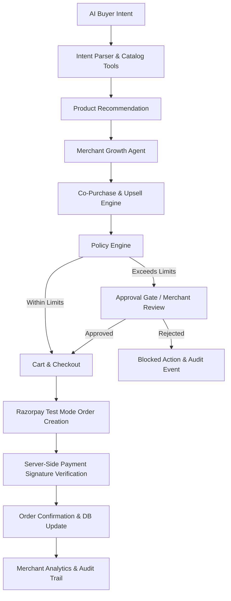

# Mercury — Policy-Governed Agentic Commerce Platform

> **"From AI intent to trusted transaction."**  
> Built for the **Razorpay Buildathon 2026 — Track 01: AI Growth & Agentic Commerce**

---

## 🌟 Overview

**Mercury** is an end-to-end agentic commerce platform connecting AI buyers with merchants while empowering an autonomous **Merchant Growth Agent** to maximize Average Order Value (AOV) under explicit, merchant-configured policy boundaries and server-verified Razorpay payments.

### Track 01 Goal Addressed
> *"Grow the merchant's revenue, and make them sellable to AI buyers."*

Mercury achieves this goal by deploying TWO cooperating AI agents:
1. **AI Buyer Agent**: Understands natural language buyer intent, searches catalog tools, ranks products with technical justifications, and guides buyers to checkout.
2. **Merchant Growth Agent**: Analyzes synthetic sales data, co-purchase affinity graphs, and customer segments to generate high-margin upsell/cross-sell recommendations (driving a **+16.6% AOV uplift**).

---

## 🏗 System Architecture



### Core Financial Governance Principle
> **The LLM never directly executes financial operations.**  
> Every request (discounts, high-value checkouts, promotional campaigns) is evaluated by the **Policy Engine** and gated by the human merchant when authority limits are breached.

---

## 🛠 Tech Stack

- **Frontend**: Next.js 14+ (App Router), React 18, TypeScript, Tailwind CSS, Recharts, Lucide Icons, Canvas Confetti.
- **Backend**: Next.js API Routes (Server-Side Node.js runtime).
- **Database & ORM**: SQLite via Prisma ORM (zero-config, portable local database seeded with 52 products, 500 customers, 1,050 orders).
- **AI Layer**: Provider-agnostic `AIProvider` abstraction with fallback rule engine for 100% deterministic hackathon evaluation.
- **Payments**: Razorpay Test Mode SDK with server-side HMAC-SHA256 signature verification (`crypto`) and mock adapter fallback.

---

## 🚀 Key Features

1. **AI Buyer Interface (`/buyer`)**:
   - Natural language search ("I need a mechanical keyboard under ₹6,000").
   - Product recommendation cards with technical justification and feature lists.
   - Interactive Merchant Growth Agent upsell offers ("31% of keyboard buyers add a wrist rest").

2. **Merchant Control Console (`/merchant`)**:
   - **Overview Dashboard**: Real-time revenue tracking, AI-assisted revenue, AOV uplift graphs (Recharts).
   - **Growth Agent Hub**: Autonomous sales recommendations based on synthetic order data analysis.
   - **Catalog & AI Metadata**: Inspect 52 catalog items, categories, inventory, and affinity scores.
   - **Orders & Payments**: Comprehensive transactions log with Razorpay status codes (Captured, Failed).
   - **Agent Policies**: Form controls to adjust financial caps (`maxAutoDiscountAmount`, `maxAutoTransactionAmount`).
   - **Approval Requests Gate**: Interactive human-in-the-loop modal to Approve or Reject out-of-bounds agent actions.
   - **Audit Trail**: Searchable, filterable audit stream showing step-by-step agent decisions and policy evaluations.

3. **1-Click Hackathon Demo Center (`/demo`)**:
   - **Success Scenario**: Runs the complete 12-step purchase loop from AI intent -> Catalog search -> Growth upsell -> Cart -> Razorpay Test Mode checkout -> Server verification -> Audit log.
   - **Graceful Failure Scenario**: Demonstrates an agent requesting an unauthorized ₹15,000 discount, which is **BLOCKED** by the Policy Engine, routed to the Approval Gate, rejected by the merchant, and recorded in the audit trail without any unauthorized money movement.

---

## 🔑 Environment Setup & Installation

### Prerequisites
- Node.js 18+ or 20+
- npm or yarn

### Environment Variables (`.env`)
Create a `.env` file in the root directory (optional for live Razorpay keys; mock mode fallback is enabled by default):

```env
# Database
DATABASE_URL="file:./dev.db"

# Razorpay Test Mode Credentials (Optional - Mock Adapter active if omitted)
RAZORPAY_KEY_ID="rzp_test_YOUR_KEY_ID"
RAZORPAY_KEY_SECRET="YOUR_KEY_SECRET"
```

### Installation Steps

1. **Install Dependencies**:
   ```bash
   npm install
   ```

2. **Push Database Schema & Seed Synthetic Data**:
   ```bash
   npx prisma db push
   npx tsx prisma/seed.ts
   ```

3. **Start Development Server**:
   ```bash
   npm run dev
   ```
   Open [http://localhost:3000](http://localhost:3000) in your browser.

4. **Production Build**:
   ```bash
   npm run build
   npm run start
   ```

---

## 📜 Audit Trail Schema

Every agent action generates an immutable audit event:
```json
{
  "timestamp": "2026-09-05T01:15:32.000Z",
  "actor": "Merchant Growth Agent",
  "agent": "GROWTH_AGENT",
  "action": "UPSELL_RECOMMENDED",
  "reason": "Recommended Ergonomic Wrist Rest (₹799) for Keychron K2 Keyboard based on 31% co-purchase rate.",
  "amount": 799,
  "policy": "Within merchant-approved limits",
  "approvalStatus": "PASSED",
  "result": "SUCCESS"
}
```

---

## 🏆 Acceptance Criteria Checklist

- [x] Application runs successfully with zero build errors.
- [x] AI Buyer Agent intent parser & catalog lookup works.
- [x] Merchant Growth Agent upsell engine drives measurable revenue impact.
- [x] Policy Engine enforces merchant discount and transaction limits.
- [x] Approval Gate intercepts out-of-bounds agent actions.
- [x] Razorpay Test Mode integration with server-side HMAC-SHA256 signature verification.
- [x] Graceful failure scenario handling unauthorized financial requests.
- [x] Dynamic analytics dashboard derived from actual SQLite database.
- [x] 1-Click Hackathon Demo Center executing in under 3 minutes.
- [x] Clean TypeScript architecture suitable for production and resume showcase.

---
